# Architecture Diagrams — Distributed Vehicle Capacity System

---

## 1. High-Level System Architecture

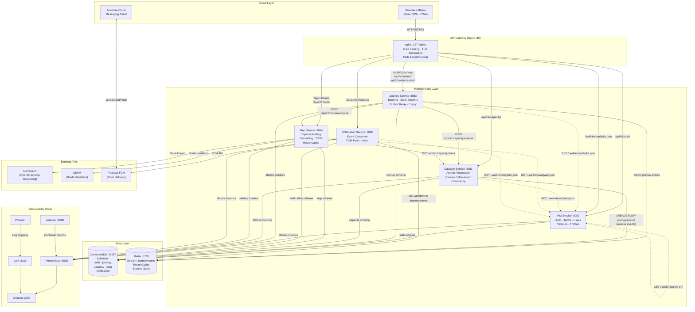

---

## 2. End-to-End Journey Booking — Full Sequence Diagram

```mermaid
sequenceDiagram
    autonumber
    actor Driver as Driver (Browser)
    participant FCM as Firebase FCM
    participant Nginx as Nginx :80
    participant Journey as Journey Service :8083
    participant Map as Map Service :8084
    participant Capacity as Capacity Service :8081
    participant IAM as IAM Service :8082
    participant Redis as Redis Stream
    participant Notif as Notification Service :8085
    participant CRDB as CockroachDB

    Note over Driver,CRDB: ═══════════════ PHASE 1: AUTHENTICATION ═══════════════

    Driver->>Nginx: POST /api/v1/auth/login {email, password}
    Nginx->>IAM: Proxy → iam-service:8082
    IAM->>CRDB: SELECT * FROM auth.users WHERE email_lower = $1
    CRDB-->>IAM: User row (password_hash, role, vehicle_type)
    IAM->>IAM: bcrypt.Compare(password, hash)
    IAM->>IAM: Generate RS256 JWT (TTL 15min)<br/>Claims: {sub, user_id, email, role, kid}
    IAM->>IAM: Generate opaque refresh token
    IAM->>CRDB: INSERT INTO auth.refresh_tokens (token_hash, expires_at, ...)
    IAM-->>Nginx: 200 {access_token, refresh_token, user}
    Nginx-->>Driver: 200 {access_token, refresh_token, user}
    Driver->>Driver: localStorage.setItem("access_token", jwt)<br/>localStorage.setItem("refresh_token", opaque)

    Note over Driver,CRDB: ═══════════════ PHASE 2: ROUTE PREVIEW ═══════════════

    Driver->>Nginx: GET /api/v1/routes/compute<br/>?origin=53.34,-6.26&dest=53.42,-6.25<br/>Authorization: Bearer JWT
    Nginx->>Map: Proxy → map-service:8084
    Map->>IAM: GET /.well-known/jwks.json (cached 1h)
    IAM-->>Map: {keys: [{kty, use, kid, n, e}]}
    Map->>Map: Verify RS256 JWT signature + expiry
    Map->>Map: Check route_path_cache (Redis/DB)
    alt Cache HIT
        Map-->>Nginx: 200 {route, segments, total_minutes}
    else Cache MISS
        Map->>Map: Run Dijkstra on in-memory graph
        Map->>Nominatim: GET /search?q=origin (geocode if needed)
        Nominatim-->>Map: [{lat, lon, display_name}]
        Map->>CRDB: Cache route in map.route_path_cache
        Map-->>Nginx: 200 {segments: [{segment_id, name, traversal_minutes}]}
    end
    Nginx-->>Driver: Route preview with segments shown on map

    Note over Driver,CRDB: ═══════════════ PHASE 3: JOURNEY BOOKING ═══════════════

    Driver->>Driver: Fill form: vehicle_type=car,<br/>departure_time=T+60min
    Driver->>Driver: Generate Idempotency-Key (UUID v4)
    Driver->>Nginx: POST /api/v1/journeys<br/>Authorization: Bearer JWT<br/>Idempotency-Key: uuid-1234<br/>{origin, destination, vehicle_type, departure_time}
    Nginx->>Journey: Proxy → journey-service:8083<br/>(rate limit: 5 req/s per IP)

    Note over Journey: JWT Validation Middleware
    Journey->>IAM: GET /.well-known/jwks.json (cached)
    IAM-->>Journey: JWKS
    Journey->>Journey: Verify JWT signature + expiry<br/>Extract: driver_id, role from claims

    Note over Journey: Idempotency Middleware
    Journey->>CRDB: SELECT FROM journey.idempotency_cache<br/>WHERE idempotency_key = 'uuid-1234'
    alt Cache HIT (duplicate request)
        CRDB-->>Journey: {journey_id, response_body}
        Journey-->>Nginx: 200 (cached response)
        Nginx-->>Driver: 200 Journey (deduplicated)
    else Cache MISS (new request)
        CRDB-->>Journey: no rows

        Note over Journey: Business Rule Validation
        Journey->>Journey: Validate: departure_time ≥ NOW + 60min
        Journey->>Journey: Validate: valid vehicle_type (car/van/motorcycle/truck)
        Journey->>CRDB: SELECT FROM journey.journeys<br/>WHERE driver_id=$1 AND status IN ('APPROVED','ACTIVE')
        alt Has active journey
            CRDB-->>Journey: existing journey row
            Journey-->>Nginx: 409 Conflict "Driver already has active journey"
            Nginx-->>Driver: 409 Error
        else No active journey
            CRDB-->>Journey: no rows

            Note over Journey,Map: ─── Step A: Route Computation ───
            Journey->>Map: POST /api/v1/routes/compute<br/>{origin_lat, origin_lng, dest_lat, dest_lng,<br/>departure_time, vehicle_type}
            Map->>Map: Check route_path_cache
            Map->>CRDB: SELECT from map.route_path_cache
            Map->>Map: Dijkstra shortest path on graph
            Map-->>Journey: {<br/>  route_id, total_minutes,<br/>  segments: [<br/>    {segment_id:"seg_city_north",<br/>     traversal_minutes:8},<br/>    {segment_id:"seg_north_airport",<br/>     traversal_minutes:16}<br/>  ]<br/>}
            Journey->>Journey: Compute time windows per segment:<br/>seg[0]: T+0..T+8min<br/>seg[1]: T+8min..T+24min

            Note over Journey,Capacity: ─── Step B: Atomic Capacity Reservation ───
            Journey->>Capacity: POST /api/v1/capacity/reserve<br/>{<br/>  journey_id, reservation_id (new UUID),<br/>  vehicle_type: "car" (slots=1.0),<br/>  segments: [<br/>    {id:"seg_city_north", window_start, window_end},<br/>    {id:"seg_north_airport", window_start, window_end}<br/>  ]<br/>}

            Note over Capacity: Idempotency Check
            Capacity->>CRDB: SELECT FROM capacity.idempotency_cache<br/>WHERE idempotency_key = reservation_id
            CRDB-->>Capacity: no rows

            Note over Capacity: Serializable Transaction
            Capacity->>CRDB: BEGIN TRANSACTION ISOLATION LEVEL SERIALIZABLE
            Capacity->>Capacity: Sort segments by segment_id (deadlock prevention)

            loop For each segment (sorted)
                Capacity->>CRDB: SELECT segment_id, max_capacity FROM capacity.segments<br/>WHERE segment_id=$1 FOR UPDATE
                CRDB-->>Capacity: {max_capacity: 100.0}
                Capacity->>CRDB: SELECT COUNT(*) FROM capacity.segment_closures<br/>WHERE segment_id=$1 AND closes_at <= now AND reopens_at >= now
                alt Segment is closed
                    CRDB-->>Capacity: closure exists
                    Capacity->>CRDB: ROLLBACK
                    Capacity-->>Journey: 200 {status:"failed",<br/>failed_segment:{id,reason:"segment_closed"}}
                else Segment open
                    CRDB-->>Capacity: no closures
                    Capacity->>CRDB: SELECT SUM(slots_used) FROM capacity.reservations<br/>WHERE segment_id=$1<br/>AND status='active'<br/>AND time_window_start < $window_end<br/>AND time_window_end > $window_start
                    CRDB-->>Capacity: current_usage: 45.0
                    Capacity->>Capacity: Check: 45.0 + 1.0 ≤ 100.0 → PASS
                end
            end

            Capacity->>CRDB: INSERT INTO capacity.reservations<br/>(reservation_id, journey_id, segment_id,<br/>time_window_start, time_window_end,<br/>vehicle_type, slots_used, status='active')<br/>× 2 segments
            Capacity->>CRDB: INSERT INTO capacity.idempotency_cache<br/>(key, journey_id, reservation_id, status, body)
            Capacity->>CRDB: COMMIT
            CRDB-->>Capacity: OK (2 reservations created)
            Capacity-->>Journey: 201 {<br/>  status: "reserved",<br/>  reservation_id: "rsv_abc123",<br/>  reserved_segments: [...]<br/>}

            Note over Journey,CRDB: ─── Step C: Persist Journey ───
            Journey->>CRDB: BEGIN TRANSACTION
            Journey->>CRDB: INSERT INTO journey.journeys<br/>(journey_id="jrn_xyz", driver_id,<br/>status='APPROVED', reservation_id,<br/>origin, destination, departure_time,<br/>estimated_arrival, vehicle_type,<br/>idempotency_key, version=1)
            Journey->>CRDB: INSERT INTO journey.journey_segments<br/>(journey_id, segment_id, segment_name,<br/>sequence_order, time_window_start,<br/>time_window_end, traversal_minutes)<br/>× N segments
            Journey->>CRDB: INSERT INTO journey.outbox<br/>(event_id, event_type='journey.booked',<br/>payload={journey_id, driver_id, segments,...},<br/>published=false)
            Journey->>CRDB: INSERT INTO journey.idempotency_cache<br/>(key='uuid-1234', journey_id, response_body)
            Journey->>CRDB: COMMIT
            CRDB-->>Journey: OK

            Journey-->>Nginx: 201 {<br/>  journey_id: "jrn_xyz",<br/>  status: "APPROVED",<br/>  reservation_id: "rsv_abc123",<br/>  segments: [...],<br/>  departure_time, estimated_arrival<br/>}
            Nginx-->>Driver: 201 Journey Created (APPROVED)
            Driver->>Driver: Navigate to /driver/booking-result<br/>Show "Journey Approved ✓"
        end
    end

    Note over Driver,CRDB: ═══════════════ PHASE 4: OUTBOX RELAY → EVENT STREAMING ═══════════════

    loop Outbox relay goroutine polls every 1 second
        Journey->>CRDB: SELECT * FROM journey.outbox<br/>WHERE published=false<br/>ORDER BY id LIMIT 100
        CRDB-->>Journey: [{event_id, event_type:'journey.booked', payload}]
        Journey->>Redis: XADD journey.events * {<br/>  event_id, event_type,<br/>  timestamp, payload<br/>}
        Redis-->>Journey: stream-entry-id
        Journey->>CRDB: UPDATE journey.outbox<br/>SET published=true, published_at=now<br/>WHERE event_id=$1
    end

    Note over Driver,CRDB: ═══════════════ PHASE 5: NOTIFICATION DELIVERY ═══════════════

    loop Notification consumer goroutine
        Notif->>Redis: XREADGROUP GROUP notification-service<br/>consumer-1 COUNT 10 STREAMS journey.events >
        Redis-->>Notif: [{event_id, event_type:'journey.booked', payload}]
        Notif->>Notif: Map event → Notification:<br/>title="Journey Approved"<br/>message="Your booking is confirmed"<br/>type="success"
        Notif->>CRDB: INSERT INTO notification.notifications<br/>(event_id, driver_id, journey_id,<br/>event_type, title, message,<br/>delivery_status='PENDING')
        Notif->>CRDB: SELECT fcm_token FROM notification.device_tokens<br/>WHERE driver_id=$1 AND is_active=true
        CRDB-->>Notif: fcm_token (if registered)
        alt FCM token exists
            Notif->>FCM: POST to FCM API<br/>{token, notification:{title, body}, data:{journey_id}}
            alt FCM delivery success
                FCM-->>Notif: {messageId}
                Notif->>CRDB: UPDATE notification.notifications<br/>SET delivery_status='SENT', sent_at=now
            else FCM delivery failed (retry < 3)
                FCM-->>Notif: error
                Notif->>CRDB: UPDATE notification.notifications<br/>SET delivery_status='RETRYING',<br/>retry_count=retry_count+1, last_error=$1
            end
        else No FCM token
            Notif->>CRDB: UPDATE notification.notifications<br/>SET delivery_status='SKIPPED'
        end
        Notif->>Redis: XACK journey.events notification-service {entry-id}
    end

    FCM->>Driver: Push notification:<br/>"Journey Approved: Your booking is confirmed"
    Driver->>Nginx: GET /api/v1/notifications<br/>Authorization: Bearer JWT
    Nginx->>Notif: Proxy
    Notif->>CRDB: SELECT FROM notification.notifications<br/>WHERE driver_id=$1 ORDER BY created_at DESC
    CRDB-->>Notif: notifications list
    Notif-->>Driver: 200 {notifications:[...], unread_count:1}
```

---

## 3. Authentication & JWT Flow

```mermaid
sequenceDiagram
    autonumber
    participant Client as Frontend Client
    participant Nginx as Nginx
    participant IAM as IAM Service
    participant Service as Protected Service<br/>(Journey/Capacity/Map/Notif)
    participant CRDB as CockroachDB

    Note over Client,CRDB: ─── Registration ───
    Client->>Nginx: POST /api/v1/auth/register<br/>{name, email, password, role?, vehicle_type?}
    Nginx->>IAM: Proxy
    IAM->>IAM: Validate email format + uniqueness
    IAM->>IAM: bcrypt.GenerateFromPassword(password, cost=12)
    IAM->>CRDB: INSERT INTO auth.users<br/>(id=nanoid, name, email, email_lower,<br/>password_hash, role='driver', vehicle_type='car')
    CRDB-->>IAM: user created
    IAM-->>Client: 201 {user: {id, name, email, role}}

    Note over Client,CRDB: ─── Login ───
    Client->>Nginx: POST /api/v1/auth/login {email, password}
    Nginx->>IAM: Proxy
    IAM->>CRDB: SELECT * FROM auth.users WHERE email_lower=$1
    CRDB-->>IAM: user row
    IAM->>IAM: bcrypt.Compare(password, password_hash)
    IAM->>IAM: jwt.NewWithClaims(RS256, {<br/>  sub: user.ID,<br/>  user_id: user.ID,<br/>  email: user.Email,<br/>  role: user.Role,<br/>  exp: now+15min,<br/>  iat: now,<br/>  kid: "key-id-123"<br/>})
    IAM->>IAM: token.SignedString(rsaPrivateKey)
    IAM->>IAM: Generate 32-byte crypto random refresh token
    IAM->>IAM: sha256(refreshToken) → token_hash
    IAM->>CRDB: INSERT INTO auth.refresh_tokens<br/>(user_id, token_hash, expires_at=+7days,<br/>user_agent, ip_address)
    CRDB-->>IAM: OK
    IAM-->>Client: 200 {access_token:JWT, refresh_token:opaque, user}
    Client->>Client: localStorage.set("access_token", JWT)<br/>localStorage.set("refresh_token", opaque)

    Note over Client,CRDB: ─── Authenticated API Call ───
    Client->>Nginx: ANY /api/v1/...<br/>Authorization: Bearer {JWT}
    Nginx->>Service: Proxy with headers
    Service->>Service: Extract Bearer token from header
    Service->>IAM: GET /.well-known/jwks.json (cache 1h)
    IAM-->>Service: {keys:[{kty:"RSA", kid, n, e}]}
    Service->>Service: Find key where key.kid == jwt.header.kid
    Service->>Service: rsa.VerifyPKCS1v15(publicKey, jwt.signature)
    Service->>Service: Check jwt.claims.exp > now (30s clock skew allowed)
    Service->>Service: ctx.Set("driver_id", claims.UserID)<br/>ctx.Set("role", claims.Role)
    Service-->>Client: Protected resource

    Note over Client,CRDB: ─── Token Refresh ───
    Client->>Client: Detect: jwt.exp < now OR received 401
    Client->>Nginx: POST /api/v1/auth/refresh<br/>{refresh_token: "opaque..."}
    Nginx->>IAM: Proxy
    IAM->>IAM: sha256(refresh_token) → lookup_hash
    IAM->>CRDB: SELECT * FROM auth.refresh_tokens<br/>WHERE token_hash=$1<br/>AND revoked_at IS NULL<br/>AND expires_at > NOW()
    CRDB-->>IAM: token row (valid)
    IAM->>IAM: Generate new RS256 JWT
    IAM->>IAM: Optionally rotate refresh token
    IAM-->>Client: 200 {access_token: new_JWT, refresh_token: rotated}
    Client->>Client: localStorage.update("access_token", new_JWT)

    Note over Client,CRDB: ─── Logout ───
    Client->>Nginx: POST /api/v1/auth/logout<br/>Authorization: Bearer JWT
    Nginx->>IAM: Proxy
    IAM->>CRDB: UPDATE auth.refresh_tokens<br/>SET revoked_at=NOW()<br/>WHERE user_id=$1 AND revoked_at IS NULL
    CRDB-->>IAM: OK (all sessions revoked)
    IAM-->>Client: 200 OK
    Client->>Client: localStorage.clear()
    Client->>Client: Navigate to /auth (LoginPage)

    Note over Client,CRDB: ─── JWKS Endpoint (Public) ───
    Service->>IAM: GET /.well-known/jwks.json
    IAM->>IAM: Load RSA public key from keys/public.pem
    IAM-->>Service: {<br/>  "keys": [{<br/>    "kty": "RSA",<br/>    "use": "sig",<br/>    "kid": "key-id-123",<br/>    "alg": "RS256",<br/>    "n": "base64url(modulus)",<br/>    "e": "AQAB"<br/>  }]<br/>}
```

---

## 4. Capacity Reservation — Atomic Concurrency Control

```mermaid
sequenceDiagram
    autonumber
    participant JA as Journey Service A<br/>(Driver 1)
    participant JB as Journey Service B<br/>(Driver 2)
    participant Capacity as Capacity Service
    participant CRDB as CockroachDB<br/>(Serializable Isolation)
    participant Redis as Redis

    Note over JA,Redis: ─── Concurrent Reservation Attempt on Same Segment ───

    par Driver 1 books seg_city_north
        JA->>Capacity: POST /api/v1/capacity/reserve<br/>{journey_id:"jrn_001", segments:[seg_city_north, seg_north_port]}
    and Driver 2 books same segment
        JB->>Capacity: POST /api/v1/capacity/reserve<br/>{journey_id:"jrn_002", segments:[seg_city_north, seg_south_gate]}
    end

    Note over Capacity: Sort segments alphabetically to prevent deadlocks
    Capacity->>Capacity: Sort: [seg_city_north, seg_north_port] (A already sorted)
    Capacity->>Capacity: Sort: [seg_city_north, seg_south_gate] (B already sorted)

    par Txn A starts
        Capacity->>CRDB: BEGIN ISOLATION LEVEL SERIALIZABLE (Txn A)
        Capacity->>CRDB: SELECT ... FROM capacity.segments<br/>WHERE segment_id='seg_city_north' FOR UPDATE (Txn A)
        CRDB-->>Capacity: Locks seg_city_north (Txn A holds lock)
    and Txn B starts
        Capacity->>CRDB: BEGIN ISOLATION LEVEL SERIALIZABLE (Txn B)
        Capacity->>CRDB: SELECT ... FROM capacity.segments<br/>WHERE segment_id='seg_city_north' FOR UPDATE (Txn B)
        CRDB->>CRDB: Txn B WAITS (seg_city_north locked by Txn A)
    end

    Capacity->>CRDB: SUM(slots_used) WHERE segment_id='seg_city_north'<br/>AND time_window overlaps (Txn A)
    CRDB-->>Capacity: current_usage=95.0 (Txn A reads 95/100)
    Capacity->>Capacity: 95.0 + 1.0 = 96.0 ≤ 100.0 → PASS (Txn A)
    Capacity->>CRDB: INSERT INTO capacity.reservations (seg_city_north) (Txn A)
    Capacity->>CRDB: Lock next: seg_north_port FOR UPDATE (Txn A)
    CRDB-->>Capacity: seg_north_port locked
    Capacity->>CRDB: SUM(slots_used) WHERE segment_id='seg_north_port' (Txn A)
    CRDB-->>Capacity: current_usage=20.0 → PASS
    Capacity->>CRDB: INSERT INTO capacity.reservations (seg_north_port) (Txn A)
    Capacity->>CRDB: COMMIT (Txn A)
    CRDB-->>Capacity: COMMIT OK (Txn A)
    Capacity-->>JA: 201 {status:"reserved", reservation_id:"rsv_A001"}

    CRDB->>Capacity: seg_city_north lock released (Txn B unblocked)
    Capacity->>CRDB: SELECT ... FOR UPDATE seg_city_north (Txn B now runs)
    CRDB-->>Capacity: seg_city_north available (Txn B holds lock)
    Capacity->>CRDB: SUM(slots_used) WHERE segment_id='seg_city_north' (Txn B)
    CRDB-->>Capacity: current_usage=96.0 (now includes Txn A's reservation!)
    Capacity->>Capacity: 96.0 + 1.0 = 97.0 ≤ 100.0 → PASS (Txn B)
    Capacity->>CRDB: INSERT INTO capacity.reservations (seg_city_north) (Txn B)
    Capacity->>CRDB: Lock: seg_south_gate FOR UPDATE (Txn B)
    Capacity->>CRDB: SUM(slots_used) seg_south_gate (Txn B)
    CRDB-->>Capacity: 50.0 → PASS
    Capacity->>CRDB: COMMIT (Txn B)
    CRDB-->>Capacity: COMMIT OK
    Capacity-->>JB: 201 {status:"reserved"}

    Note over JA,Redis: ─── Capacity Full Scenario ───
    JA->>Capacity: POST /api/v1/capacity/reserve<br/>{segments:[seg_at_max]}
    Capacity->>CRDB: BEGIN SERIALIZABLE
    Capacity->>CRDB: SELECT ... FOR UPDATE seg_at_max
    CRDB-->>Capacity: max_capacity=100.0
    Capacity->>CRDB: SUM(slots_used) active reservations (window overlap)
    CRDB-->>Capacity: current_usage=100.0
    Capacity->>Capacity: 100.0 + 1.0 > 100.0 → FAIL
    Capacity->>CRDB: ROLLBACK
    CRDB-->>Capacity: OK
    Capacity-->>JA: 200 {<br/>  status:"failed",<br/>  failed_segment:{<br/>    segment_id:"seg_at_max",<br/>    reason:"at_capacity",<br/>    current_usage:100.0,<br/>    max_capacity:100.0<br/>  }<br/>}

    Note over JA,Redis: ─── Closure Scenario ───
    JA->>Capacity: POST /api/v1/capacity/reserve<br/>{segments:[seg_closed]}
    Capacity->>CRDB: BEGIN SERIALIZABLE
    Capacity->>CRDB: SELECT id FROM capacity.segment_closures<br/>WHERE segment_id='seg_closed'<br/>AND closes_at <= window_end<br/>AND reopens_at >= window_start
    CRDB-->>Capacity: closure exists (maintenance until +2h)
    Capacity->>CRDB: ROLLBACK
    Capacity-->>JA: 200 {status:"failed", reason:"segment_closed"}

    Note over JA,Redis: ─── Serialization Retry (CockroachDB 40001) ───
    Capacity->>CRDB: COMMIT (concurrent write conflict)
    CRDB-->>Capacity: ERROR 40001: restart transaction
    Capacity->>Capacity: Retry attempt 1/5
    Capacity->>CRDB: ROLLBACK
    Capacity->>CRDB: BEGIN SERIALIZABLE (retry)
    Note over Capacity,CRDB: ...repeats up to 5 times...
    CRDB-->>Capacity: COMMIT OK (on retry 2)
    Capacity-->>JA: 201 {status:"reserved"}

    Note over JA,Redis: ─── Capacity Release via Redis Event ───
    JA->>Redis: XADD journey.events {event_type:'journey.cancelled', journey_id}
    Redis-->>Capacity: XREADGROUP (capacity consumer)
    Capacity->>CRDB: UPDATE capacity.reservations<br/>SET status='released', released_at=NOW()<br/>WHERE journey_id=$1 AND status='active'
    CRDB-->>Capacity: 2 rows updated (reservations released)
```

---

## 5. Journey State Machine

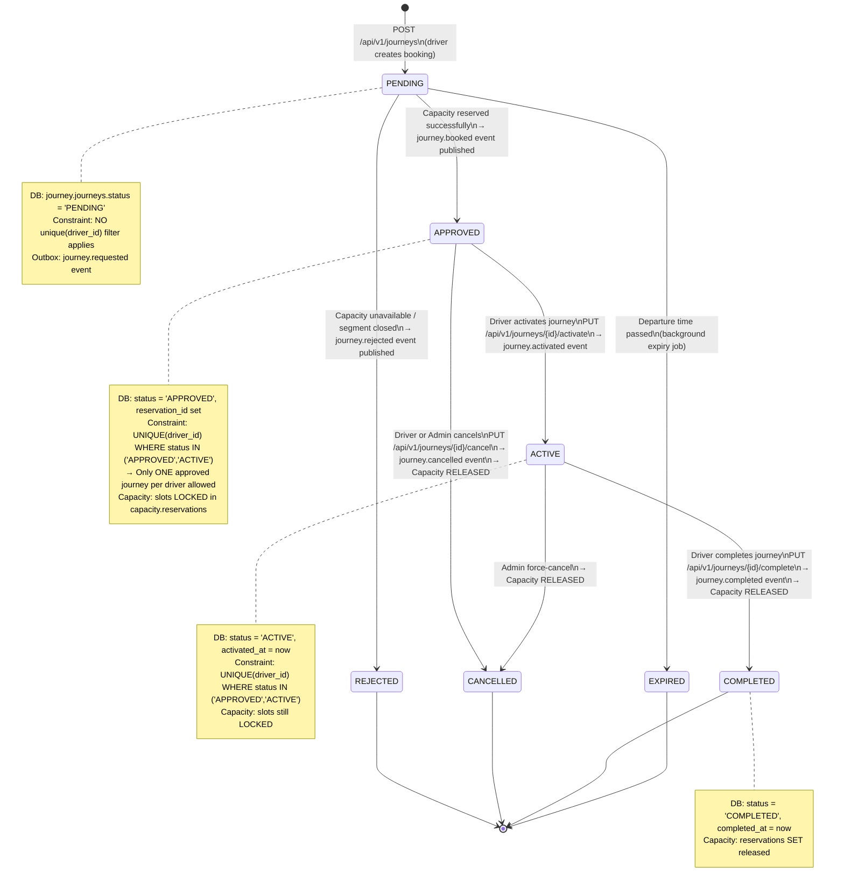

---

## 6. Transactional Outbox Pattern

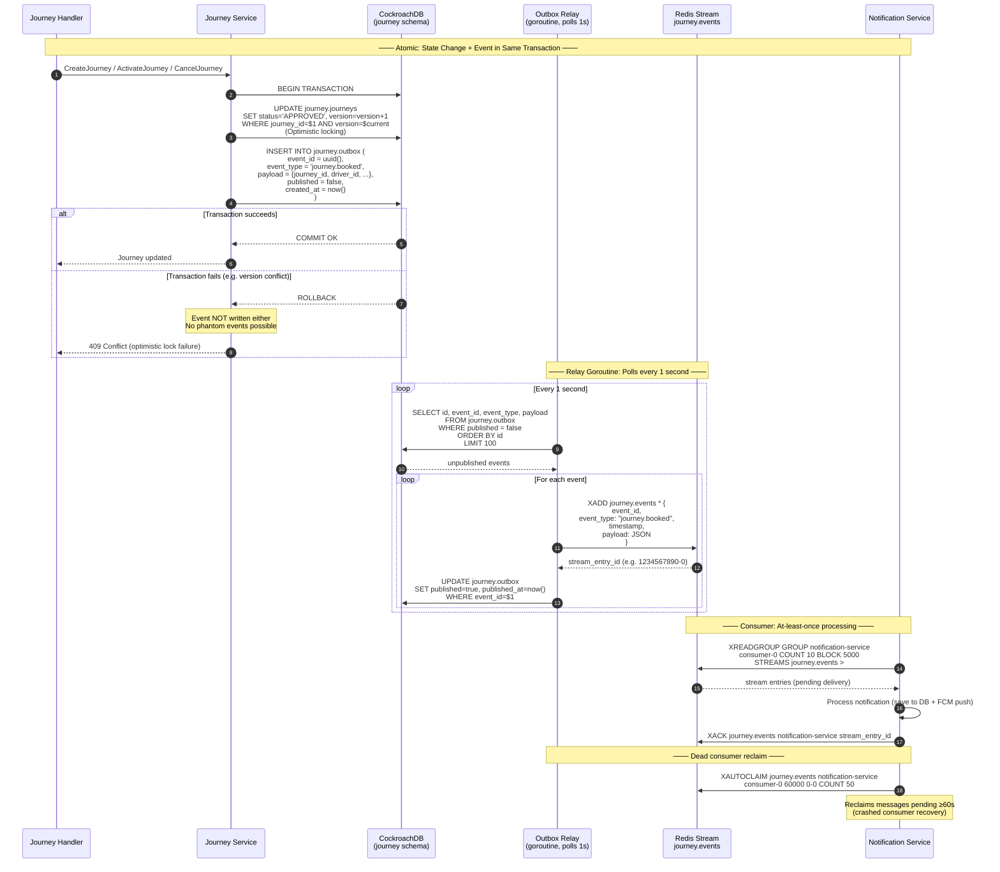

---

## 7. Map Service — Route Computation Detail

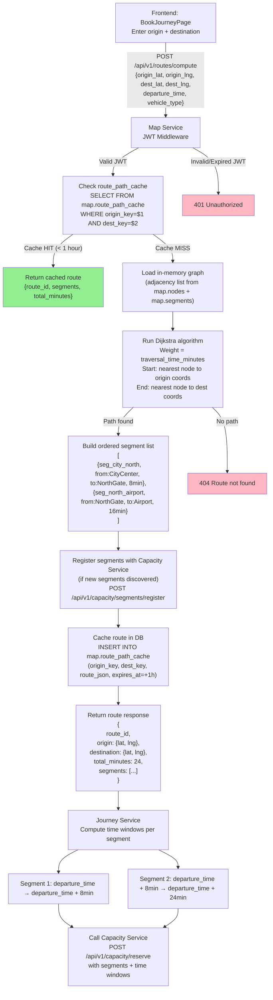

---

## 8. Database Entity Relationship Diagram

```mermaid
erDiagram
    %% IAM Schema
    auth_users {
        VARCHAR_40 id PK
        VARCHAR_100 name
        VARCHAR_254 email
        VARCHAR_254 email_lower UK
        VARCHAR_255 password_hash
        VARCHAR_10 role "driver|admin"
        VARCHAR_15 vehicle_type
        JSONB license_info
        TIMESTAMPTZ created_at
        TIMESTAMPTZ updated_at
    }

    auth_refresh_tokens {
        BIGSERIAL id PK
        VARCHAR_40 user_id FK
        VARCHAR_64 token_hash UK
        TIMESTAMPTZ expires_at
        TIMESTAMPTZ revoked_at
        TEXT user_agent
        INET ip_address
        TIMESTAMPTZ created_at
    }

    auth_user_vehicles {
        VARCHAR_40 id PK
        VARCHAR_40 user_id FK
        VARCHAR_20 vehicle_type
        JSONB license_info
        BOOLEAN is_primary
        TIMESTAMPTZ created_at
    }

    %% Journey Schema
    journey_journeys {
        VARCHAR_20 journey_id PK
        VARCHAR_50 driver_id "ref auth.users.id"
        VARCHAR_64 idempotency_key UK
        DECIMAL_9_6 origin_lat
        DECIMAL_9_6 origin_lng
        DECIMAL_9_6 dest_lat
        DECIMAL_9_6 dest_lng
        TIMESTAMPTZ departure_time
        TIMESTAMPTZ estimated_arrival
        VARCHAR_20 vehicle_type
        VARCHAR_20 status "PENDING|APPROVED|REJECTED|ACTIVE|COMPLETED|CANCELLED|EXPIRED"
        TEXT rejection_reason
        VARCHAR_30 reservation_id
        INTEGER version
        TIMESTAMPTZ cancelled_at
        TIMESTAMPTZ activated_at
        TIMESTAMPTZ completed_at
        TIMESTAMPTZ expired_at
        TIMESTAMPTZ created_at
        TIMESTAMPTZ updated_at
    }

    journey_segments {
        SERIAL id PK
        VARCHAR_20 journey_id FK
        VARCHAR_30 segment_id "ref capacity.segments"
        VARCHAR_100 segment_name
        INTEGER sequence_order
        TIMESTAMPTZ time_window_start
        TIMESTAMPTZ time_window_end
        INTEGER traversal_minutes
        VARCHAR_50 region
    }

    journey_outbox {
        BIGSERIAL id PK
        VARCHAR_64 event_id UK
        VARCHAR_50 event_type
        JSONB payload
        BOOLEAN published
        TIMESTAMPTZ created_at
        TIMESTAMPTZ published_at
    }

    journey_idempotency_cache {
        VARCHAR_64 idempotency_key PK
        VARCHAR_20 journey_id
        JSONB response_body
        TIMESTAMPTZ created_at
        TIMESTAMPTZ expires_at
    }

    journey_events {
        VARCHAR_20 event_id PK
        VARCHAR_20 journey_id FK
        VARCHAR_50 event_type
        VARCHAR_10 actor_type "driver|admin|system"
        VARCHAR_50 actor_id
        JSONB metadata
        TIMESTAMPTZ created_at
    }

    %% Capacity Schema
    capacity_segments {
        VARCHAR_30 segment_id PK
        VARCHAR_100 segment_name
        VARCHAR_20 region
        DECIMAL_10_2 max_capacity
        INTEGER version
        TIMESTAMPTZ created_at
        TIMESTAMPTZ updated_at
    }

    capacity_reservations {
        BIGSERIAL id PK
        VARCHAR_30 reservation_id
        VARCHAR_20 journey_id
        VARCHAR_30 segment_id FK
        TIMESTAMPTZ time_window_start
        TIMESTAMPTZ time_window_end
        VARCHAR_20 vehicle_type
        DECIMAL_10_2 slots_used
        VARCHAR_10 status "active|released"
        TIMESTAMPTZ created_at
        TIMESTAMPTZ released_at
    }

    capacity_segment_closures {
        SERIAL id PK
        VARCHAR_30 segment_id FK
        VARCHAR_255 reason
        TIMESTAMPTZ closes_at
        TIMESTAMPTZ reopens_at
        VARCHAR_40 created_by
        TIMESTAMPTZ created_at
    }

    capacity_idempotency_cache {
        VARCHAR_64 idempotency_key PK
        VARCHAR_20 journey_id
        VARCHAR_30 reservation_id
        VARCHAR_10 response_status
        JSONB response_body
        TIMESTAMPTZ created_at
        TIMESTAMPTZ expires_at
    }

    %% Map Schema
    map_nodes {
        TEXT node_id PK
        TEXT label
        DOUBLE lat
        DOUBLE lng
        INT sort_order
    }

    map_segments {
        TEXT segment_id PK
        TEXT segment_name
        TEXT region
        TEXT from_node_id FK
        TEXT to_node_id FK
        INT traversal_time_minutes
        INT sort_order
    }

    %% Notification Schema
    notification_notifications {
        VARCHAR_20 notification_id PK
        VARCHAR_40 event_id UK
        VARCHAR_40 driver_id
        VARCHAR_20 journey_id
        VARCHAR_40 event_type
        VARCHAR_120 title
        TEXT message
        VARCHAR_20 type "info|success|warning|error"
        VARCHAR_20 delivery_status "PENDING|SENT|FAILED|SKIPPED|RETRYING"
        INTEGER retry_count
        BOOLEAN is_read
        TIMESTAMPTZ read_at
        TIMESTAMPTZ sent_at
        TIMESTAMPTZ failed_at
        TIMESTAMPTZ created_at
    }

    notification_device_tokens {
        VARCHAR_20 device_token_id PK
        VARCHAR_40 driver_id
        TEXT fcm_token UK
        VARCHAR_20 platform "web|android|ios"
        BOOLEAN is_active
        TIMESTAMPTZ last_seen_at
        TIMESTAMPTZ invalidated_at
        TIMESTAMPTZ created_at
    }

    %% Relationships
    auth_users ||--o{ auth_refresh_tokens : "has sessions"
    auth_users ||--o{ auth_user_vehicles : "owns vehicles"
    journey_journeys ||--o{ journey_segments : "covers segments"
    journey_journeys ||--o{ journey_events : "timeline"
    capacity_segments ||--o{ capacity_reservations : "has reservations"
    capacity_segments ||--o{ capacity_segment_closures : "can be closed"
    map_nodes ||--o{ map_segments : "from_node"
    map_nodes ||--o{ map_segments : "to_node"
```

---

## 9. Frontend State & Data Flow

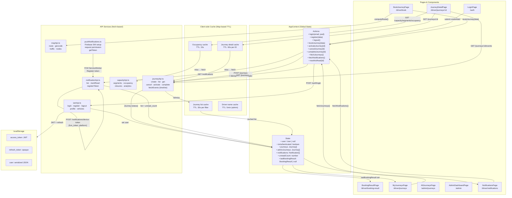

---

## 10. Infrastructure & Deployment Architecture

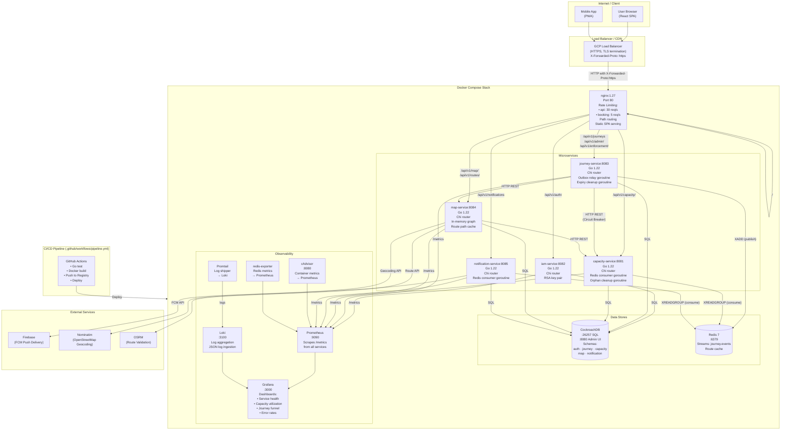

---

## 11. Nginx API Gateway Routing Table

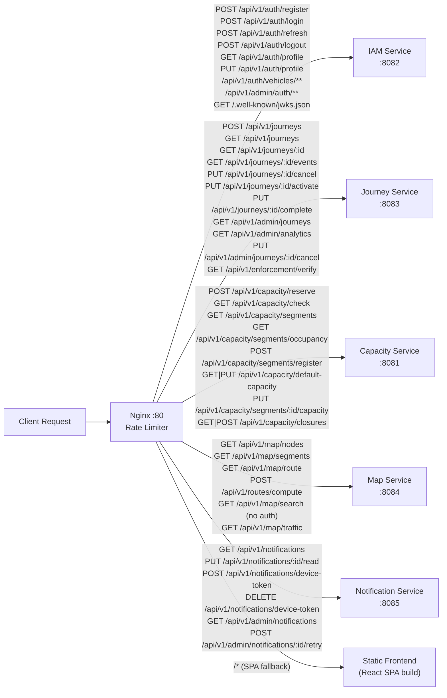

---

## 12. Event Flow — Redis Streams

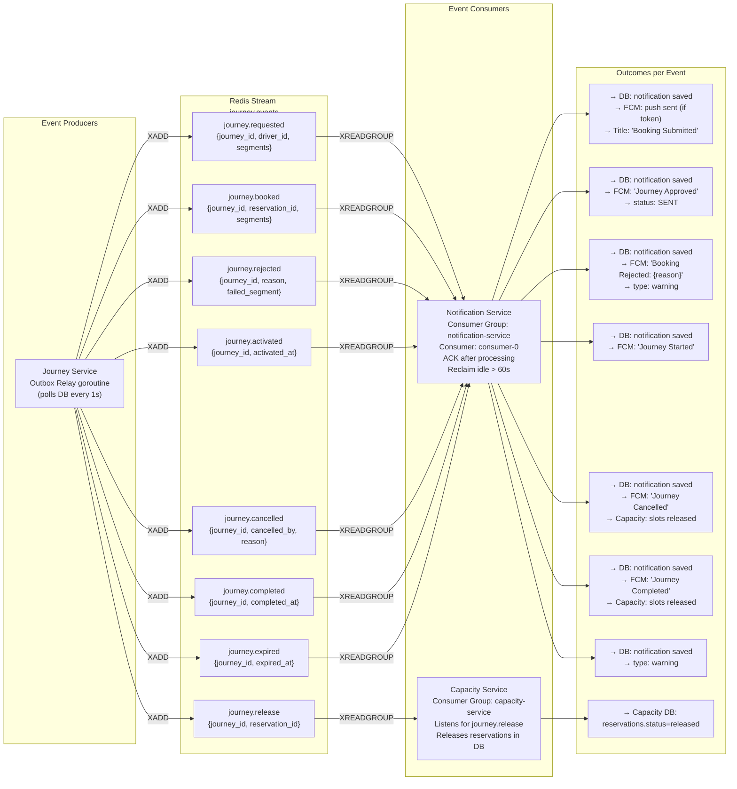

---

## 13. Observability & Metrics Pipeline

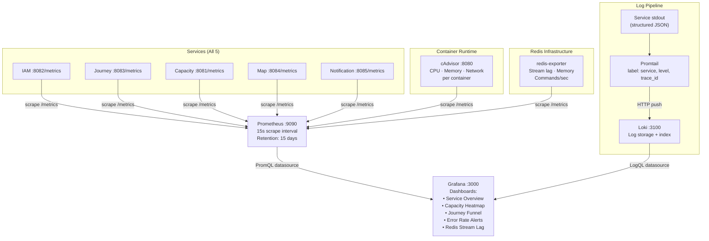

---

*Generated from full codebase analysis — covers all 5 microservices, frontend, database schemas, event flows, and infrastructure.*
